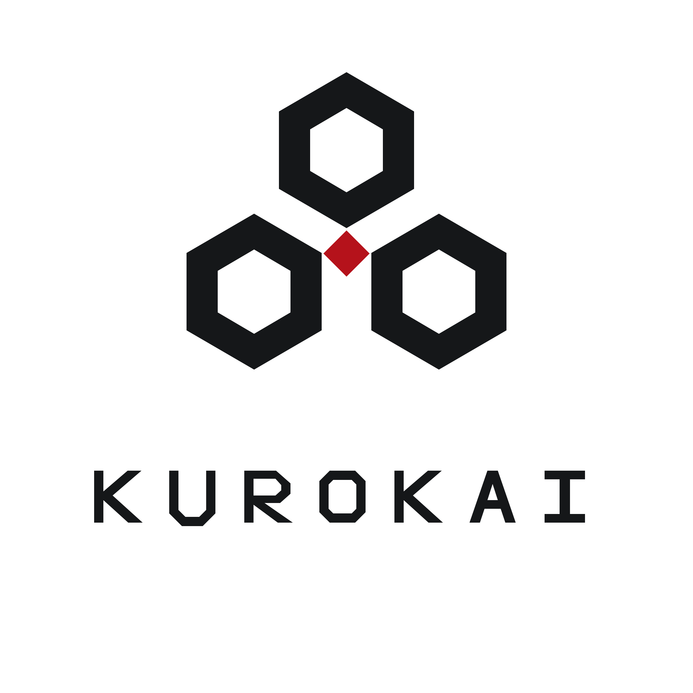

# Kurokai

**Kurokai** is both the name of a ruling family and the megacorporate state identified with that dynasty.

Kurokai is a cold, polished, high-technology power defined by:

- hereditary corporate rule;
- internal loyalty and disciplined hierarchy;
- surveillance and intelligence operations;
- cybernetics, neural systems, precision weapons, and secret research;
- a small but exceptionally trained and equipped private military;
- strict control of information, personnel, and intellectual property.

Its public image is refined, stable, sophisticated, and responsible. Beneath that image, it treats knowledge, loyalty, and often people themselves as corporate property.

## Visual identity

The canonical Kurokai master logo is a minimalist corporate-house lockup:

- three hollow black hexagons arranged as a compact triangular mark;
- a dominant red diamond joining the three forms;
- a widely spaced uppercase **KUROKAI** wordmark;
- flat geometric construction with strong negative space;
- black, white, and deep red as the complete master palette.

The SVG is the resolution-independent master. The PNG is the standard raster version.
