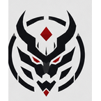

# Kurokai

**Kurokai** is both the name of a ruling family and the megacorporate state identified with that dynasty.

Kurokai is a cold, polished, high-technology power defined by:

- hereditary corporate rule;
- internal loyalty and disciplined hierarchy;
- surveillance and intelligence operations;
- cybernetics, neural systems, precision weapons, and secret research;
- a small but exceptionally trained and equipped private military;
- strict control of information, personnel, and intellectual property.

Its public image is refined, stable, sophisticated, and responsible. Beneath that image, it treats knowledge, loyalty, and often people themselves as corporate property.

## Visual identity

The canonical Kurokai master emblem is the angular oni mask:

- a symmetrical black and dark-charcoal oni face;
- long upward horns and narrow red eyes;
- a red diamond centered on the forehead;
- a small red diamond beneath the jaw;
- flat geometric construction with sharp negative space;
- no wordmark or surrounding crest in the locked master emblem.
