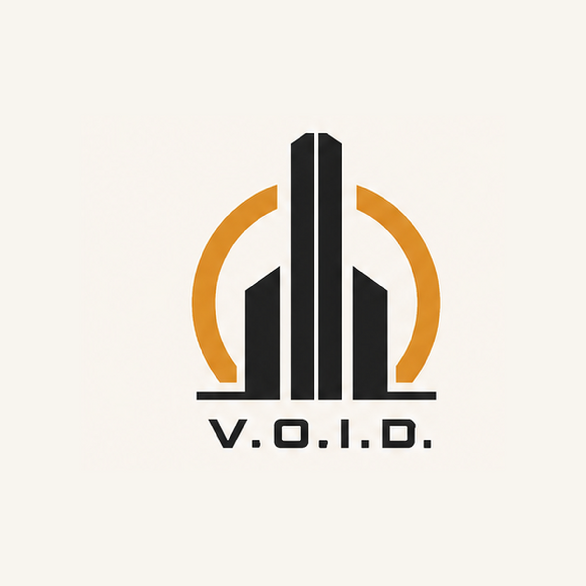

# V.O.I.D.

**V.O.I.D.** stands for **Venture Operations, Infrastructure & Development**.

V.O.I.D. is the rugged industrial-frontier megacorporate state of Consortium Space. Its operations include:

- asteroid and moon mining;
- ice harvesting and mining barges;
- outpost and habitat construction;
- remote expedition support;
- heavy industrial and frontier infrastructure.

Every expedition, mine, outpost, and construction project includes standard corporate protection. Officially these are basic guarding operations that protect workers, convoys, equipment, and remote sites. In practice, their shared training, equipment, command, patrol craft, and permanent presence form a dispersed corporate military without being publicly described as one.

> **Where V.O.I.D. builds, its guards arrive first and rarely leave.**

## Visual identity

The canonical V.O.I.D. master logo combines:

- a broken safety-amber orbital ring;
- a tall, split central tower flanked by lower industrial structures;
- a heavy black baseline suggesting a constructed frontier horizon;
- the punctuated uppercase **V.O.I.D.** wordmark;
- graphite black, dirty white, and safety amber as the complete palette.

The mark evokes a permanent outpost rising inside a hostile frontier: infrastructure first, expansion afterward.
